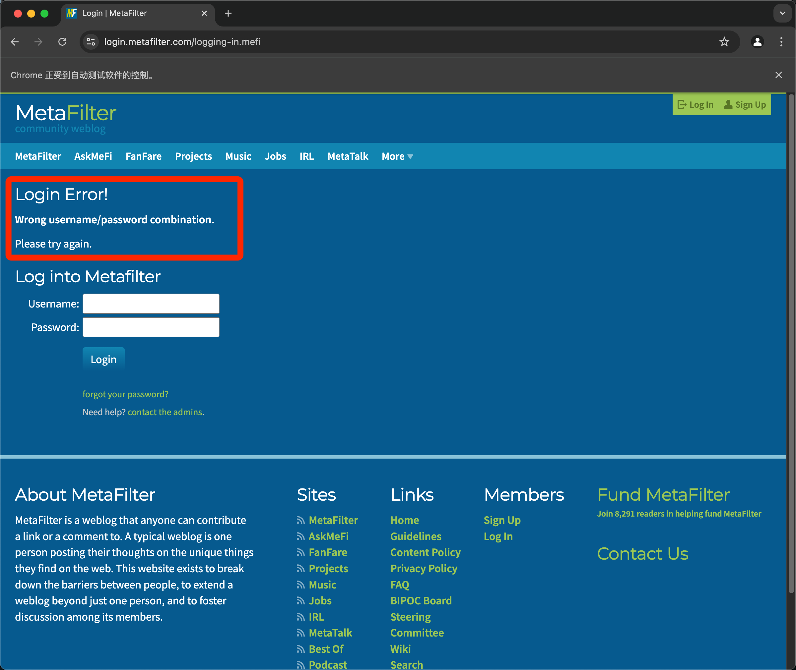

# 从web获取信息
## request_get.py
下载《罗密欧与朱丽叶》并打印前 250 个字符
## bs4_get.py
使用 BeautifulSoup4 获取 example.html 中的 html 内容并筛选处理
## searchpypi.py
打开  https://pypi.org/  搜索到的前 5 个包的信息，并自动在 tab 页中打开

使用前提：
pip install beautifulsoup4
pip install requests
pip install lxml

使用方法：
python searchpypi.py 包名(python3 searchpypi.py 包名)

自动在浏览器中打开搜索结果的前五个 tab 页详情

结果和自行在搜索框搜索结果一致

扩展：程序改编后同样适用于其他网站

## downloadXkcd.py
下载 xkcd 网站的所有漫画，持续下载 30s 后自动停止
使用前提：
pip install beautifulsoup4
pip install requests
pip install lxml

使用方法：
python downloadXkcd.py(python3 downloadXkcd.py)

下载图片保存在此处

扩展：顺着网站的所有链接本分整个网站，复制整个论坛的所有信息，复制一个在线商店中所有产品目录等
### TODO：
1、怎么监控当前内存资源消耗情况
2、怎么并行下载，让下载更多内容时处理的更快？

## openchrome.py
使用selenium打开浏览器
使用方法：python3 openchrome.py（过程中可能会有 chromedriver 的报错，按照提示修改即可，主要是 chromedriver 和 chrome 的版本保持一致）
效果如下：

使用 selenium 打开 apple 中国官网

## searchelements.py
打开浏览器跳转到指定页面，找到带有指定类名的元素并打印出来
使用方法：python3 searchelements.py

## clickthepage.py
使用 selenium 打开指定页面，点击指定元素
使用方法：python3 clickthepage.py
打开 https://inventwithpython.com 后，自动点击 “Read Online for Free” 并跳转到对应页面

可自行修改打开网页，触发点击事件，例如可以改成自动跳转 bilibili 的热门 tab 页

## submittingforms.py
使用 selenium 打开指定页面，找到指定表单并提交
使用方法：python3 clickthepage.py

可以尝试使用自己的账号密码在 bilibili 登录

重点时如何定位到元素
test